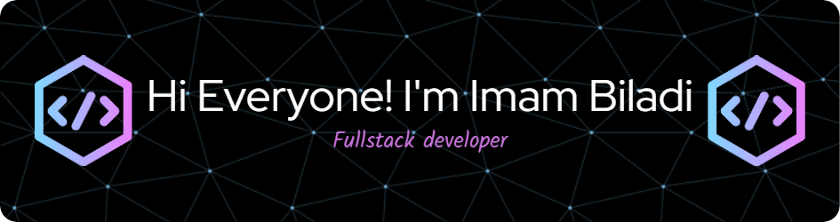

<!--
**ImamBiladi27/ImamBiladi27** is a ✨ _special_ ✨ repository because its `README.md` (this file) appears on your GitHub profile.

Here are some ideas to get you started:

- 🔭 I’m currently working on ...
- 🌱 I’m currently learning ...
- 👯 I’m looking to collaborate on ...
- 🤔 I’m looking for help with ...
- 💬 Ask me about ...
- 📫 How to reach me: ...
- 😄 Pronouns: ...
- ⚡ Fun fact: ...
-->

- 🔭 I’m currently working on **@Orbiz** as Fullstack **Web Developer**
- 🌱 I have experience web programming languange like **Laravel**, **CI3**, **Javascript**.
- 👯 I’m looking to freelance or part time.

    <h1 style="text-align:center;">My Portofolio</h1>

- **pokodex** project using angular js with **Typescript** languange programming.

- **my experience work** using laravel 10 integration **RESTFULL API**, **JQUERY**, **AJAX**.
